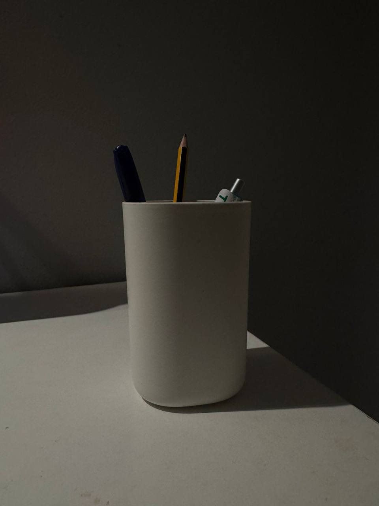

# Pen-Holder-design
This repository contains my Onshape pen holder design project  
The pen holder is a cylindrical container used to organize pens and pencils on a desk
## Tools used in Onshape
- Extrude add  
- Shell  
- Fillet  
- Chamfer  

## Measuring tools
- Ruler  
- Vernier caliper  
- Measuring tape  

 [Onshape Model Link](https://cad.onshape.com/documents/9cec58c3a9960e2f69728b91/w/a696a5ecaa47a9953e1a4fd2/e/cde3c0f2da60bd67d21bc866?configuration=List_1jMbTF1KVu8Lgk%3DDefault%3BList_G2tGBnXfW5R2wQ%3DDefault&renderMode=0&uiState=68e01a1e2bf24365c83d44be)

## Screenshots  
Here are some images of the pen holder design
  

## Real Object Photo  

This is the real pen holder 

